# Azure Fundamental Questions

### Q1. To what should an application connect to retrieve security tokens?

* A. an Azure Storage account
* B. Azure Active Directory (Azure AD)
* C. a certificate store
* D. an Azure key vault

##  Answer: B

    Explanation: 
    Section: Understand Security, Privacy, Compliance and Trust

### Q.2 You have several virtual machines in an Azure subscription. You create a new subscription. The virtual machines cannot be moved to the new subscription.Instructions: Review the underlined text. If it makes the statement correct, select “No change is needed”. If the statement is incorrect, select the answer choice that makes the statement correct.
* A. No change is needed
* B. The virtual machines can be moved to the new subscription
* C. The virtual machines can be moved to the new subscription only if they are all in the same resource group
* D. The virtual machines can be moved to the new subscription only if they run Windows Server 2016.

### Answer: B

    Explanation: 
    Section: Understand Azure Pricing and Support

### Q.3 Note: This question is part of a series of questions that present the same scenario. Each question in the series contains a unique solution that might meet the stated goals. Some question sets might have more than one correct solution, while others might not have a correct solution. After you answer a question in this section, you will NOT be able to return to it. As a result, these questions will not appear in the review screen.

### Your company plans to purchase Azure. The company’s support policy states that the Azure environment must provide an option to access support engineers by phone or email. You need to recommend which support plan meets the support policy requirement.

### Q. 3A. Solution: Recommend a Basic support plan. Does this meet the goal?

* A. Yes
* B. No

### Answer: B 

### Q. 3B. Solution: Recommend a Premier support plan. Does this meet the goal?
* A. Yes
* B. No

### Answer: A

### Solution: Recommend a Standard support plan. Does this meet the goal?

* A. Yes
* B. No

### Answer: A


### Q.4 Note: This question is part of a series of questions that present the same scenario. Each question in the series contains a unique solution that might meet the stated goals. Some question sets might have more than one correct solution, while others might not have a correct solution. After you answer a question in this section, you will NOT be able to return to it. As a result, these questions will not appear in the review screen.

    An Azure administrator plans to run a PowerShell script that creates Azure resources. You need to recommend which computer configuration to use to run the script.

### Solution: Run the script from a computer that runs Linux and has the Azure CLI tools installed. Does this meet the goal?

* A. Yes
* B. No

### Answer: B


### Q5. You plan to map a network drive from several computers that run Windows 10 to Azure Storage. You need to create a storage solution in Azure for the planned mapped drive.
## What should you create?

* A. an Azure SQL database
* B. a virtual machine data disk
* C. a Files service in a storage account
* D. a Blobs service in a storage account

### Answer: C

### Q6. Several support engineers plan to manage Azure by using the computers shown in the following table:
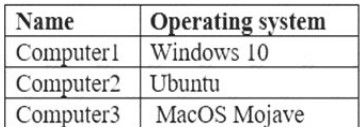

### You need to identify which Azure management tools can be used from each computer. What should you identify for each computer? To answer, select the appropriate options in the answer area. NOTE: Each correct selection is worth one point
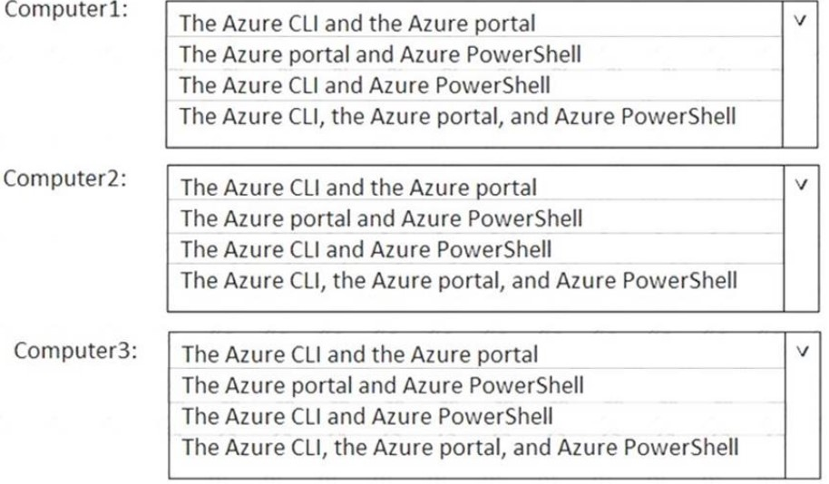

### Answer
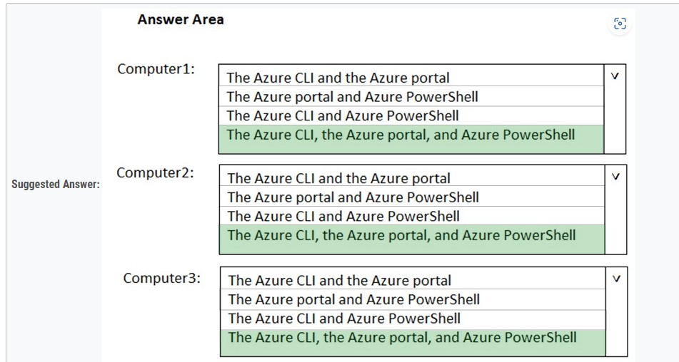


### Q7. To what should an application connect to retrieve security tokens?

* A. an Azure Storage account
* B. Azure Active Directory (Azure AD)
* C. a certificate store
* D. an Azure key vault

### Answer B

### Q.8 You have several virtual machines in an Azure subscription. You create a new subscription. The virtual machines cannot be moved to the new subscription. Instructions: Review the underlined text. If it makes the statement correct, select “No change is needed”. 
If the statement is incorrect, select the answer choice that makes the statement correct.

* A. No change is needed
* B. The virtual machines can be moved to the new subscription
* C. The virtual machines can be moved to the new subscription only if they are all in the same resource group
* D. The virtual machines can be moved to the new subscription only if they run Windows Server 2016.

### Answer: B


### Q.9 You create a resource group named RG1 in Azure Resource Manager. You need to prevent the deletion of the resources in RG1. Which setting should you use? To answer, select the appropriate setting in the answer area.

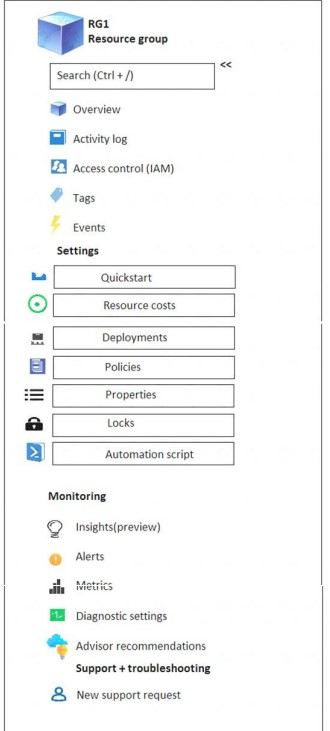
### Answer:
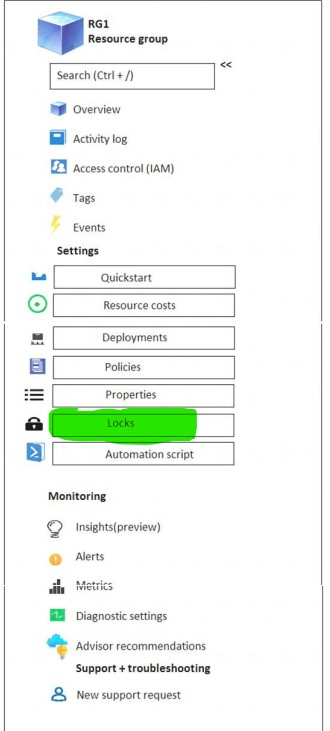

### Q.10 Your Azure trial account expired last week. You are now unable to create additional Azure Active Directory (Azure AD) user accounts. 
```
Instructions: Review the underlined text. If it makes the statement correct, select “No change is needed”. If the statement is incorrect, select the answer choice
that makes the statement correct.
```

* A. No change is needed
* B. start an existing Azure virtual machine
* C. access your data stored in Azure
* D. access the Azure portal

### Answer: A

### Q.11 Your company has several business units. Each business unit requires 20 different Azure resources for daily operation. All the business units require the same type of Azure resources. You need to recommend a solution to automate the creation of the Azure resources. What should you include in the recommendations?

* A. Azure Resource Manager templates
* B. virtual machine scale sets
* C. the Azure API Management service
* D. management groups

### Answer: A


### Q.12 What are two characteristics of the public cloud? Each correct answer presents a complete solution. NOTE: Each correct selection is worth one point.

* A. dedicated hardware
* B. unsecured connections
* C. limited storage
* D. metered pricing
* E. self-service management

### Answer: DE


### Q.13 Your company plans to request an architectural review of an Azure environment from Microsoft. The company currently has a Basic support plan. You need to recommend a new support plan for the company. The solution must minimize costs. Which support plan should you recommend?

* A. Premier
* B. Developer
* C. Professional Direct
* D. Standard

### Answer: A

### Q.14 An Azure administrator plans to run a PowerShell script that creates Azure resources. You need to recommend which computer configuration to use to run the script.
```
Solution: Run the script from a computer that runs Chrome OS and uses Azure Cloud Shell. Does this meet the goal?
```

* A. Yes
* B. No

### Answer: B
```
Solution: Run the script from a computer that runs macOS and has PowerShell Core 6.0 installed. Does this meet the goal?
```
* A. Yes
* B. No

### Answer: A


### Q.15 An Azure administrator plans to run a PowerShell script that creates Azure resources. You need to recommend which computer configuration to use to run the script.

```
Which three computers can run the script? Each correct answer presents a complete solution.
NOTE: Each correct selection is worth one point.
```
* A. a computer that runs macOS and has PowerShell Core 6.0 installed.
* B. a computer that runs Windows 10 and has the Azure PowerShell module installed.
* C. a computer that runs Linux and has the Azure PowerShell module installed.
* D. a computer that runs Linux and has the Azure CLI tools installed.
* E. a computer that runs Chrome OS and uses Azure Cloud Shell.

### Answer: ABE


### Q.16 Your Azure environment contains multiple Azure virtual machines. You need to ensure that a virtual machine named VM1 is accessible from the Internet over HTTP. Solution: You modify an Azure Traffic Manager profile. Does this meet the goal?
* A. Yes
* B. No
### Answer: B

### Explaination: we need to make chnages in the firewal rules in azure portal.

### Q.17 For each of the following statements, select Yes if the statement is true. Otherwise, select No. NOTE: Each correct selection is worth one point.


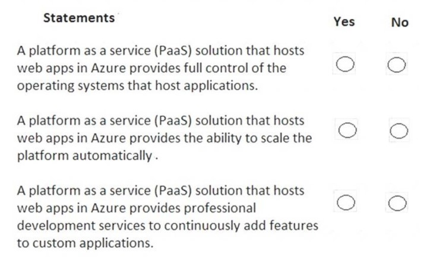
### Answer:
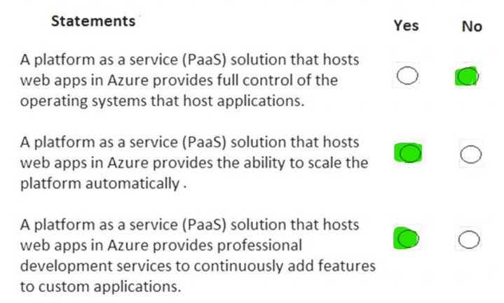


### Q.18 For each of the following statements, select Yes if the statement is true. Otherwise, select No. NOTE: Each correct selection is worth one point.


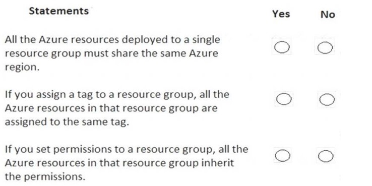
### Answer:
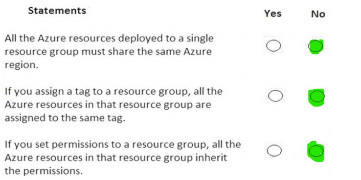


### Q.19 You need to view a list of planned maintenance events that can affect the availability of an Azure subscription. Which blade should you use from the Azure portal? To answer, select the appropriate blade in the answer area.
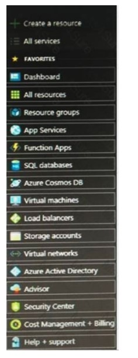
### Answer:
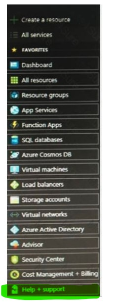

### Q.20 To what should an application connect to retrieve security tokens?

* A. an Azure Storage account
* B. Azure Active Directory (Azure AD)
* C. a certificate store
* D. an Azure key vault

### Answer: B


### Q20.This question requires that you evaluate the underlined text to determine if it is correct. 

### You have several virtual machines in an Azure subscription. You create a new subscription. The virtual machines cannot be moved to the new subscription.

```
Instructions: Review the underlined text. If it makes the statement correct, select “No change is needed”. If the statement is incorrect, select the answer choice
that makes the statement correct.
```
* A. No change is needed
* B. The virtual machines can be moved to the new subscription
* C. The virtual machines can be moved to the new subscription only if they are all in the same resource group
* D. The virtual machines can be moved to the new subscription only if they run Windows Server 2016.

### Answer: B


### Q.21 Match the Azure service to the correct description. Instructions: To answer, drag the appropriate Azure service from the column on the left to its description on the right. Each service may be used once, more than once, or not at all.

## NOTE: Each correct selection is worth one point

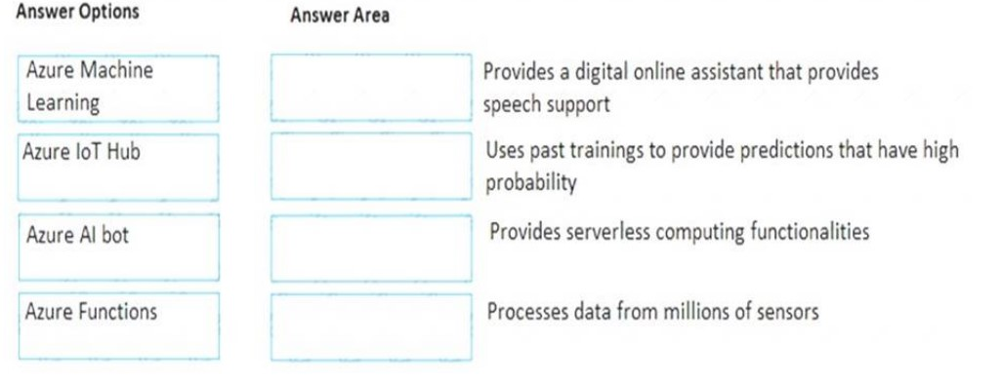
### Answer:
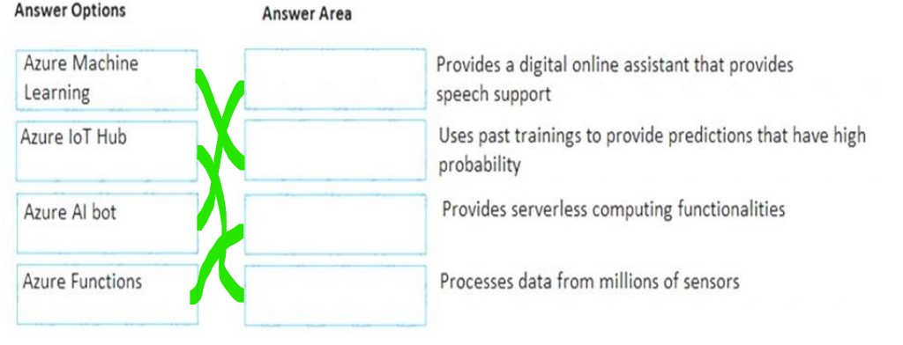


### Q.22 You plan to deploy a critical line-of-business application to Azure. The application will run on an Azure virtual machine. You need to recommend a deployment solution for the application. The solution must provide a guaranteed availability of 99.99 percent.

### What is the minimum number of virtual machines and the minimum number of availability zones you should recommend for the deployment? To answer, select the appropriate options in the answer area.
### NOTE: Each correct selection is worth one point.


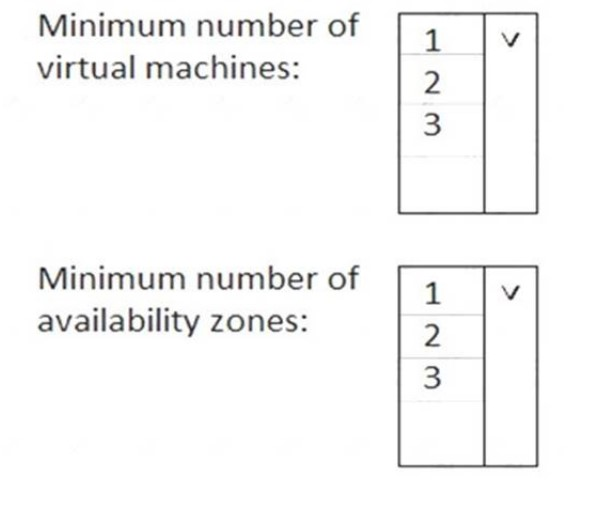
### Answer:
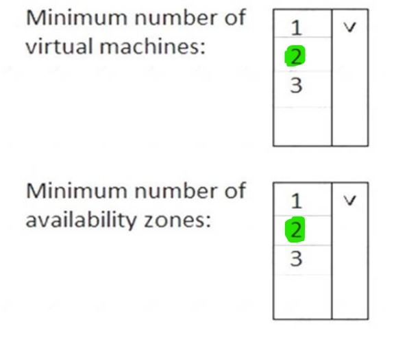


### Q.23 For each of the following statements, select Yes if the statement is true. Otherwise, select No. NOTE: Each correct selection is worth one point


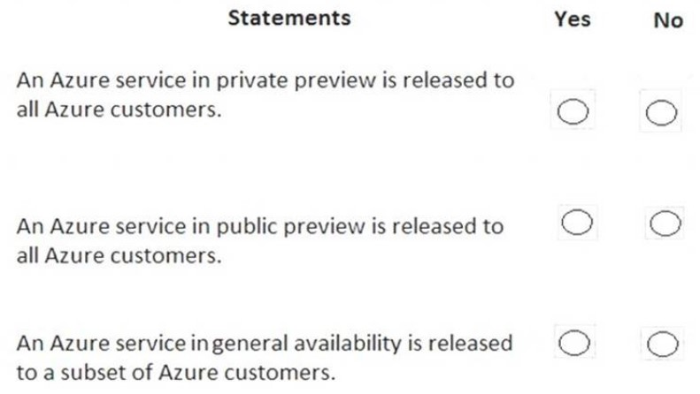
### Answer:
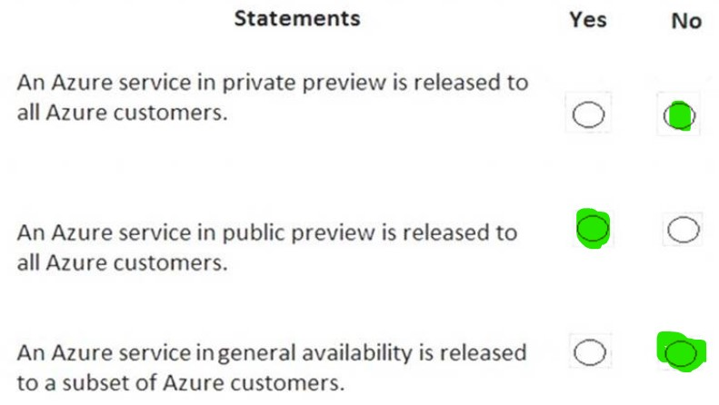


### Answer:


### Q.9


### Answer:


### Q.9


### Answer:


### Q.9


### Answer:


### Q.9


### Answer:


### Q.9


### Answer:


### Q.9


### Answer:


### Q.9


### Answer:


### Q.9


### Answer:


### Q.9


### Answer:


### Q.9


### Answer:


### Q.9


### Answer:


### Q.9


### Answer:


### Q.9


### Answer:


### Q.9


### Answer:


### Q.9


### Answer:


### Q.9


### Answer:


### Q.9


### Answer:


### Q.9


### Answer:


### Q.9


### Answer:


### Q.9


### Answer:


### Q.9


### Answer:


### Q.9


### Answer:


### Q.9


### Answer:


### Q.9


### Answer:


### Q.9


### Answer:


### Q.9


### Answer:


### Q.9


### Answer:


### Q.9


### Answer:


### Q.9


### Answer:


### Q.9


### Answer:


### Q.9


### Answer:


### Q.9


### Answer:


### Q.9


### Answer:


### Q.9


### Answer:


### Q.9


### Answer:


### Q.9


### Answer:


### Q.9


### Answer:


### Q.9


### Answer:


### Q.9


### Answer:


### Q.9


### Answer:


### Q.9


### Answer:


### Q.9


### Answer:


### Q.9


### Answer:


### Q.9


### Answer:

